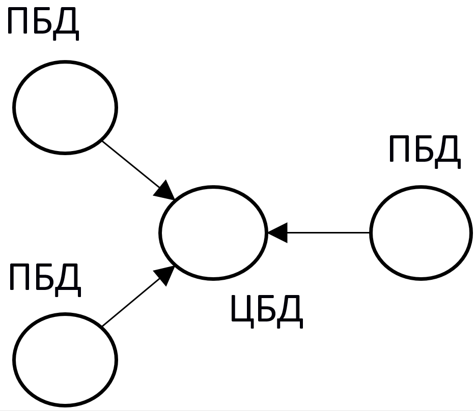

# Лабораторные работы по дисциплине "Технологии баз данных" на факультете ПМИ, НГТУ
&nbsp; 

## QUERIES
Запросы к сделанным лабораторным работам и курсовой. Теоретические лабораторные: 1, 2, 3; практические: 4, 5, 8, 9, COURSE.   
&nbsp; 

## 4. Встроенный SQL
### Запросы из варианта

1. Выдать число деталей, поставлявшихся для изделий, у которых есть поставки с весом от 5000 до 6000.
2. Поменять местами вес деталей из Рима и из Парижа, т. е. деталям из Рима установить вес детали из Парижа, а деталям из Парижа установить вес детали из Рима. Если деталей несколько, брать наименьший вес.
3. Найти детали, имеющие поставки, объем которых не превышает половину максимального объема поставки этой детали поставщиком из Парижа.
4. Выбрать поставщиков, не поставивших ни одной из деталей, поставляемых для изделий из Парижа.
5. Выдать полную информацию о деталях, которые поставлялись ТОЛЬКО поставщиками, проживающими в Афинах.

### Условия задачи

1. Разработать и отладить **ESQL/С-программу**, реализующую задачу 1 из соответствующего варианта заданий, результатом которой
является единственная строка.
2. Разработать и отладить **ESQL/С-программу**, реализующую задачу 2 из соответствующего варианта заданий и связанную с модификацией
базы данных.
3. Изучить синтаксис и правила использования операторов **Declare**, **Open**, **Fetch**, **Close**, а также особенности работы с курсором.
4. Разработать и отладить набор **ESQL/С-программ**, решающих задачи 3–5 из соответствующего варианта заданий с использованием 
аппарата курсоров (последовательного и скроллирующего). Результатом работы программ является набор строк, которые подлежат выводу на 
экран с соответствующими пояснительными заголовками.  
&nbsp; 

## 5. Динамический SQL
### Запросы из варианта 

1. Получить число поставок для каждого поставщика и найти их среднее.
2. Для каждого изделия из указанного города найти суммарный объем поставок по каждой детали, для него поставлявшейся. Вывести номер изделия, название изделия, номер детали, название детали, цвет детали, суммарный объем поставок детали для изделия.
3. Ввести номер детали P*. Найти города, в которые поставлялась деталь P*, и определить, какой процент составляют поставки в каждый город от общего числа поставок детали P*. Вывести город, число поставок деталей в этот город, общее число поставок детали P*, процент.

### Условия задачи

1. Изучить синтаксис и правила использования операторов **Prepare**, **Execute**, а также особенности работы с курсором при выполнении динамического оператора **SQL**.
2. Разработать и отладить набор **ESQL/С-программ**, решающих задачи из соответствующего варианта заданий. Результатом работы программ является одна или несколько строк, которые подлежат выводу на экран с соответствующими пояснительными заголовками.  
&nbsp; 

## 8. Доступ к базам данных с использованием ADO.NET
### Запросы из варианта 
1. Получить информацию о рекомендованной цене на указанное изделие на заданную дату.
2. Для изделий, в состав которых входит заданная деталь, сдвинуть на месяц назад дату начала действия последней рекомендованной цены.

### Условия задачи
Разрабатываемое web-приложение должно удовлетворять следующим требованиям:
* содержать форму для ввода параметров запросов и отображения результатов выполнения запросов в соответствии с заданием, а также обработчик (на Visial C#) для доступа к базе данных и выполнения запросов;
* ввод параметров задания на форме может быть осуществлен либо путем ввода значений в текстовом виде, либо посредством выбора значений из предлагаемого списка (в случае, когда список может быть сформирован из БД).  
&nbsp; 

## 9. Технология Activex Data Objects (ADO)
### Запросы из варианта 

1. Для каждого изделия на конец каждого года получить:
    * размер максимальной поставки;
    * сумму, на которую выполнены поставки для изделия;
    * процент этой суммы от общей суммы по всем изделиям за год. 
    * Упорядочить по году и проценту. Выделить строки, где процент не меньше 50.  
2. Для указанных изделия и года по каждой поставке вывести:
    * сумму поставки;
    * разницу между ценой детали в поставке и средней ценой детали за год.
3. Изменить цену детали в поставке.

### Условия задачи

Разрабатываемое приложение должно удовлетворять следующимтребованиям:
* Приложение должно включать в себя три формы:  
    – модуль данных, содержащий все необходимые компоненты для работы с базой данных;  
    – форму для просмотра выборок данных;  
    – форму для выполнения запроса модификации данных.
* Соединение с базой данных должно выполняться через компонент **ADOConnection**. Для выборки данных использовать **ADOQuery**.
* Модификация данных должна выполняться либо серверной функцией, вызываемой из приложения через **ADOStoredProc**, либо запросом через **ADOQuery**.
* Просмотр выборок должен осуществляться через компоненты **DBGrid**. Просмотр должен быть согласованным (выборка по второму запросу должна выполняться для текущей строки выборки по первому запросу). Строки выборок должны быть отсортированы по указанным в задании столбцам. Названия столбцов должны быть на русском языке. Строки выборок, удовлетворяющие указанным в задании условиям, должны быть выделены (цветом фона и/или цветом/стилем шрифта).
* Визуализация формы для выполнения запроса на модификацию может вызываться либо нажатием кнопки, либо через контекстное меню.
* Ввод параметров для модификации данных может быть осуществлен либо путем ввода значений в текстовом виде, либо посредством выбора значений из предлагаемого списка.
* После модификации данных должно появляться сообщение о том, насколько успешно прошла модификация.
* В случае возникновения ошибки должно выдаваться соответствующие сообщение.  
&nbsp; 

## COURSE. Технологии тиражирования данных
### Условия задачи
Изучить технологии тиражирования данных.  

В схеме базы данных, с которой ведется работа, создаются несколько таблиц одинаковой структуры и единого содержимого, которые имитируют таблицы, находящиеся в различных базах данных.  
Таблицы могут быть любой структуры, но при этом должны содержать два поля:
* Поле даты/времени для хранения времени вставки/обновления/удаления строки.
* Символьное поле, идентифицирующее выполненную операцию (вставка/обновление/удаление) и источник изменений.  

Разработать программное обеспечение, состоящее из трех отдельных программ:
1. Программа инициализации данных (ИД).  
Записывает данные во все таблицы, участвующие в реализуемой схеме модели репликации:
    * В поле даты/времени заносится текущее время инициализации;
    * В поле идентификации операции заносится значение «Начальная вставка».  
Содержимое таблицы, идентичное во всех условных базах данных, запоминается в журнале содержимого таблиц.
2. Программа имитации работы системы (ИРС).  
С определенной дискретностью (интервал в несколько секунд) моделирует процесс работы информационной системы, выполняя следующие действия:
    * Случайным образом выбирает одну из условных баз данных.
    * Случайным образом выбирает одну из операций (вставка/обновление/удаление).
    * Если выполняется операция вставки, то в выбранную базу данных вставляется строка, в которой:  
– в поле даты/времени заносится текущее время вставки;  
– в поле идентификации операции заносится значение «Вставка».  
В журнале изменений запоминается:  
– время вставки;  
– база данных, в которую выполняется вставка;  
– вставленная строка.
    * Если выполняется операция обновления, то в выбранной базе данных обновляется строка с минимальным id, в которой:  
– в поле даты/времени заносится текущее время обновления;  
– в поле идентификации операции заносится значение «Обновление».  
В журнале изменений запоминается:  
– время обновления;  
– база данных, в которую выполняется обновление.
    * Если выполняется операция удаления, то в выбранной базе данных удаляется строка с максимальным id.  
Перед удалением в журнале изменений запоминается:  
– время удаления;  
– база данных, из которую выполняется удаление;  
– удаляемая строка.
3. Программа репликатор данных (РД).  
Работает в соответствии с моделью репликации, определенной условиями (схема репликации, условие запуска репликатора, способ разрешения коллизий).  
После выполнения цикла репликации (переноса данных и обеспечения согласованного состояния таблиц) программа РД фиксирует в журнале содержимого таблиц:  
    * Текущее время;  
    * Содержимое всех таблиц условных баз данных

### Исходные данные

| Схема репликации | Запуск репликатора  | Разрешение коллизии |
| :---------------:| :------------------:|:-------------------:|
| Однонаправленное тиражирование «Центр-филиалы» | После выполнения указанного числа транзакций, задаваемого при запуске программы РД | В пользу более позднего обновления |

Однонаправленное тиражирование «Центр-филиалы». Изменение (вставка, модификация, удаление), выполненное в одной из периферийных баз данных (ПБД), тиражируется в центральную базу данных (ЦБД).  

  

